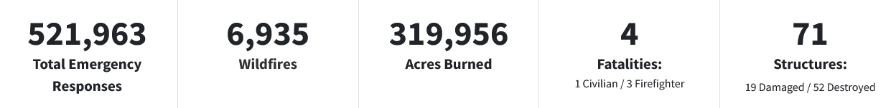
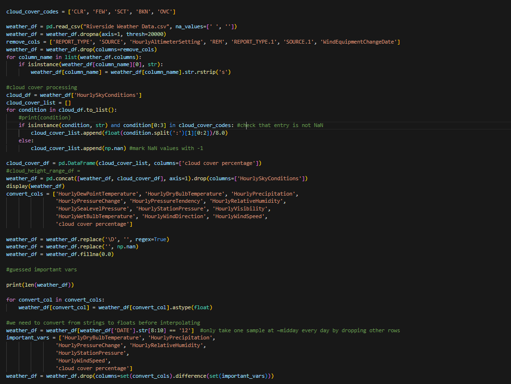
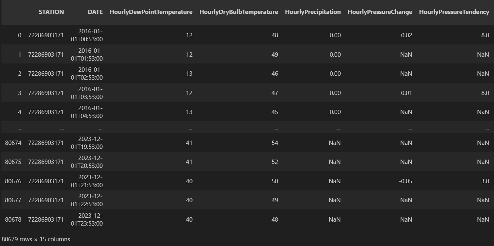
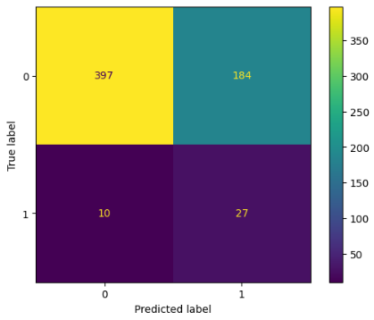
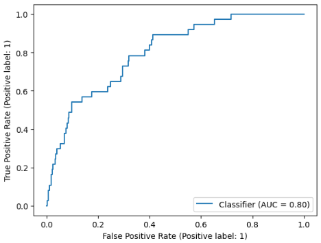

## Applications of Logistic Regression to Predict Wildfire Ignition in Riverside County

***

## Introduction 

If you are one of the 39 million people currently living in California, then you have heard about our fire season. Wildfires are one of the greatest natural threats to the people of California. Every few years, preventative power outages cover the state, thousands are evacuated, and communities are burned to the ground.

{: width="800" }

When fires spread quickly, as is often the case with high winds, minimizing response time is critical in order to prevent quadratic growth in the area burned. If we can more effectively allocate resources towards high-fire-risk areas, then we can limit the resulting spread. Thus, being able to assess the probability of a fire is useful for fire safety. My goal with this project was to make such a tool, specifically, to predict the probability of a fire starting on a given day in Riverside County.

Fortunately, there are public datasets containing historical, quantitative weather and wildfire data. This means that I can use machine learning to attempt to solve this problem. Using the sklearn library, we can associate input variables (weather data from a given day) with an output variable (whether or not there was a fire in the area that day), train a model to detect how the input variables influence the output variable, and make a prediction as to the probability of the output variable taking on a certain value. This is the idea of supervised learning.

## Data

The dataset containing information about wildfires, obtained from [`fire.ca.gov`](https://fire.ca.gov), provides wide-ranging resources relating to every documented wildfire in California since 2013. However, we only care about a small subsection: the dates that fires started, specifically those in Riverside County. To get this subset of the CSV file, I imported it as a pandas Dataframe, and filtered rows by checking the  'incident_county' column for entries of 'Riverside'. Then, I extracted the 'incident_date_created' field (don't worry, it's not an inside job) from every such row.

Preprocessing of the weather dataset, found on [`https://noaa.gov`](https://noaa.gov), was significantly more involved. As is often the case in the real world, the data collection tools were imperfect, and frequently failed to record any value. Further, the numerical data was still in string form, often (but not always) with units attached. Given the sheer size of the Dataframe, with ten years of hourly records, you can imagine why manually fixing these problems was infeasible. Instead, I wrote expressions that trimmed unnecessary fields, extracted the meaningful parts of others, and removed or replaced data where it was sparse. (Note: I only took one sample every day, between noon and 1 p.m., since the warm hours of the day vary by season, but noon is almost always among them) In the end, I narrowed down the input features to:
```python
important_vars = ['HourlyDryBulbTemperature', 'HourlyPrecipitation', 
                'HourlyPressureChange', 'HourlyRelativeHumidity', 
                'HourlyStationPressure', 
                'HourlyWindSpeed', 
                'cloud cover percentage']
```

Many of the other columns just contained values linearly dependent on the ones included.

{: width="500" }

*Figure 1: The code described above.*

{: width="500" }

*Figure 2: A subsection of the processed weather data, displayed in a pandas Dataframe.*

## Modeling

As the goal of this project was to produce an estimation of the probability of a fire starting on a given day, I had to choose a model that would output probabilities. Of the models that we learned about in this class, only two can achieve this: linear regression and neural networks. As my dataset is significantly smaller once preprocessing is done (~3000), and neural networks tend to work better on immense datasets, I chose to use a logistic regression model. 

First, I split the data into train and test sets.
```python
X = weather_df
X_train, X_test, y_train, y_test = train_test_split(X.drop(['is_fire'], axis=1), X['is_fire'], test_size=0.2)
```

Then, I used the Synthetic Minority Oversampling Technique (SMOTE) to balance the dataset, as with an imbalanced dataset, the model could be very accurate just by predicting that there would be no fire, every single day.
```python
SMOTE = SMOTE()
X_train_SMOTE, y_train_SMOTE = SMOTE.fit_resample(X_train, y_train)
```

Then, I scaled the data features, to allow the model to more rapidly converge in training. I fit an sklearn StandardScaler() to the input features training data, and then transformed both the input features training data and the input features test data.
```python
#use a scitkit learn scaler so that we can use it later for new data points:
scaler_input = StandardScaler()
scaler_input.fit(X_train_SMOTE)
data_scaled_train = scaler_input.transform(X_train_SMOTE)
data_scaled_test = scaler_input.transform(X_test)

#put the scaled data back into a dataframe
data_scaled_train = pd.DataFrame(data_scaled_train)
data_scaled_train.index = X_train_SMOTE.index
mapcols = {}
for idx in range(len(X_train_SMOTE.columns)):
    mapcols[idx] = X_train_SMOTE.columns[idx]
X_train_SMOTE = data_scaled_train.rename(columns=mapcols)

data_scaled_test = pd.DataFrame(data_scaled_test)
data_scaled_test.index = X_test.index
mapcols = {}
for idx in range(len(X_test.columns)):
    mapcols[idx] = X_test.columns[idx]
X_test = data_scaled_test.rename(columns=mapcols)
```

Finally, I fit the model to the training data, and made predictions. Further below are the results.
```python
model = LogisticRegression()
# Train the model on the training data
model.fit(X_train_SMOTE, y_train_SMOTE)

# Make predictions on the test data
y_pred = model.predict(X_test)
y_proba = model.predict_proba(X_test)
```

## Results

{: width="500" }

*Figure 3: The confusion matrix, where 1 indicates a fire and 0 no fire on a given day.*

{: width="500" }

*Figure 4: The ROC curve, with an AUC score of 0.80*

## Discussion

Figure 3 shows the confusion matrix, or the distribution of true positives, false positives, true negatives, and true positives, among the predictions. This matrix shows us that the model's strength is in identifying negatives, i.e., correctly predicting when there will not be a fire. Here, the false positive rate is 10/(397+10)~=0.025. This is with the default decision threshold of 0.5. However, since we might want to prepare for the worst case scenario for a disaster like a fire, perhaps for a more practical application of the risk assessment, the threshold should be lowered. This would cause the model to identify more true positives.

Figure 4 shows the Receiver Operating Characteristic (ROC) curve, which gives the true positive rate (TPR) and false positive rate (FPR) at all decision thresholds. This shows how our model would perform when parameterized by the most important tuning variable, the decision threshold. Let's say we wanted a TPR of 1. Then we can see that decision threshold meeting this criteria would correspond to a minimum FPR of ~0.75. Also included in this figure is the Area Under the Curve (AUC). This gives a more general overview of how a model performs for different applications (i.e., sensitivities). Since a random classifier has a AUC of 0.5, that means the model provides meaningful insight.

## Conclusion

Overall, I think that this was a productive exercise in practical application of modern machine learning tools. It's incredible the ease Python and the scikit-learn library grant to solving problems with machine learning. What remains difficult, however, is the troubles of dealing with the inconsistencies that pervade data in the real world. I could spend hours more just on the preprocessing step of this project. Other issues inherent to the nature of the data available are its scope and detail. I was unable to find any individual, comprehensive, state-wide and county-level weather database. Such a database would make it far easier to apply a similar process to other counties, but as it is, I was only able to work on this one. The issue of detail is that the wildfire database only had dates that the wildfire started, and no exact time. This means that my weather samples taken at between 12 and 1 p.m. every day could be influenced by the existence of a fire that had already started. However, given the size of Riverside county and the speed with which a fire would need to spread to have an influence on the weather the same day it was recorded, I don't think this is a major concern.

To my chagrin, I do think that the results of this project should be taken with a grain of salt. Given California's heavy investments in wildfire prevention--$3.7 Billion in the 2021-2022 budget[1]--I think it is extremely unlikely that I have come close to treading new ground. This is hard to ascertain though, given the California Department of Forestry and Fire Protection's lack of clarity in their research. Their R&D webpage[2] does not contain any links to publications or reports, or specifics about their development of AI. In the interest of the tens of millions living in the state that their department is responsible for keeping safe, I think that they should provide their methods to the public, so that we can also contribute to this cause.

## References
[1] https://lao.ca.gov/Publications/Report/4495

[2] https://www.fire.ca.gov/what-we-do/research-and-development


[Home](./)